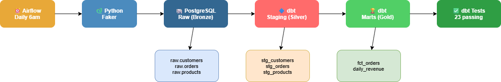

## Ecommerce Data Pipeline

End-to-end pipeline built with Python, dbt, Airflow, and PostgreSQL on EC2.

## Architecture

## Pipeline
1. Python generates daily order/customer/product data
2. Loads into PostgreSQL raw schema
3. dbt transforms Bronze → Silver → Gold
4. Airflow orchestrates daily at 6am

## Design decisions
- Local disk over S3 to keep scope tight — swap in boto3 for production
- Raw FK constraints intentionally kept to enforce data integrity at ingestion
- dbt relationships tests enforce referential integrity at transformation layer

## How to run
[steps here]

## Next steps
- SCD Type 2 for customer history
- S3 as object storage layer
- Great Expectations for advanced data quality